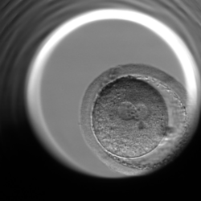
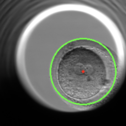
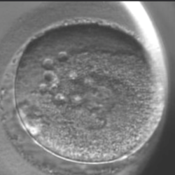
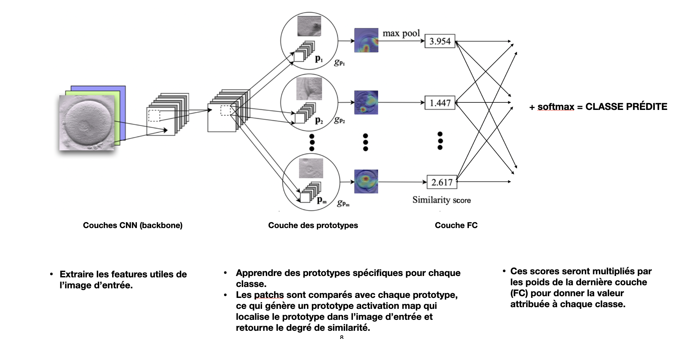
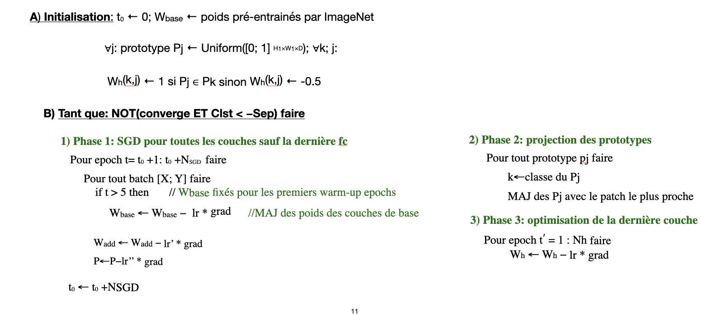

# Interpretability of a deep neural network applied for an in vitro fertilization case

### Contexte général
* L'objectif de ce travail est d'appliquer le modèle ProtoPNET, proposé par "This Looks Like That: Deep Learning for Interpretable Image Recognition", de Chaofan Chen et al. , dans un cas  d'imagerie médicale, en particulier la FIV, pour la séléction des embryons qui ont un bon potentiel d'implantation par les embryologistes. 

### Principe du modèle ProtoPNet:
* Prototype Part Network: pour une image donnée, identifie des parties (patches) qui sont similaires à des prototypes générés lors de la phase d’apprentissage, et la classifie selon des scores de similarités avec les prototypes.

### Dataset
* Le dataset que nous utilisons est composé de 756 vidéos. Chaque vidéo contient entre 300 et 600 images avec une résolution de 500 x 500 pixels. Chaque vidéo illustre le développement d’un embryon particulier et chaque frame de chaque vidéo correspond finalement à une classe. Étant donné que nous avons travaillé sur la prédiction de la phase d’apparition des pronuclei tPN, on élimine par conséquent chaque image qui dépasse la fin de cette phrase particulière.

Lien du dataset: [link](zenodo.org/record/6390798/files/embryo_dataset.tar.gz?download=1)

Pour améliorer la qualité des données, on applique un cropping automatique avec Hough Transform et une amélioration des paramètres de brillance et contraste des frames.

| Before processing | Region of Interest | New samples  |
|---|---|--|
||||

### Repository Structure
* **ProtoPN_publicData.ipynb** : notebook contenant l'exécution du prétraitement et de l'apprentissage du modèle (pour le dataset public)
* **ProtoPN_localData.ipynb** : notebook contenant l'exécution du prétraitement et de l'apprentissage du modèle (pour le dataset local)
* **densenet_features.py & resnet_features.py** : 2 fichiers contenant toutes les architectures backbone Densenet (densenet121, densenet161...) et Resnet (resnet18, resnet34, resnet50...), avec quelques modifications pour réduire l'overfit.
* **model .py** : définit le modèle ProtoPNet: backbone (CNN, pour l'extraction des features) - additional layers (conv 1*1) - couche de génération des prototypes - FC layer.
    * Les couches additionnelles sont utilisées pour : `Dimensionality reduction` (Réduction du nombre de paramètres) & `receptive field control` (contrôler l'architecture du réseau : lier les différentes parties: interemédiaire).
* **train_and_test.py** : utilisé lors de la phase d'**apprentissage** et pour le calcul des différents métriques: Cross Entropy, Cluster cost, Separation cost, etc, pour les données de training ainsi que les données du test.
* **image_analysis.py** : Utilisé pour les tests du modèle qui est déja entrainé, avec une image d'entrée (local tests).
* **saved_models** : répertoire utilisé pour sauvegarder toutes les exécutions de la phase d'apprenitssage : les prototypes, le fichier log des métriques, un snapshot du modèle (fichier des poids.pth) si on dépasse un seuil fixé d'accuracy.
* **pretrained_models** : répertoire pour sauvegarder les poids des modèles backbones utililsés, si on opte pour un apprentiisage avec l'option pretrained.
* **preprocess.py** : pour la normalisation des entrées (controler les poids).
* **hough** : code de Hough Transform pour le cropping des images.

`Techniques utilisées lors de l’apprentissage:`
  * La valeur de learning rate (diminue) tout au long de l’apprentissage, selon les valeurs de perte.
  * Un controle des poids de chaque couche:
      * Commencer par N ‘warm epochs’, où les poids du modèle backbone: resnet50 (ceux de imagenet) ne sont pas modifiés (freezed), et passer à la phase ‘joint epochs’ ou toutes les couches sont concernées par l’optimisation.
      * Les 2 premiers blocs du backbone sont gelés, car les features des premières couches seront communes, pas besoin de les modifier, et aussi pour accélérer la phase du training.
      * La phase de projection des prototypes commencent à l’epoch _push_start_ ( pour avoir des prototypes significatifs).

L'architecture définit par model.py :

L'algorithme de la phase d'apprentissage:

`Différentes phases de l'apprentissage:`
*  **1. Optimisation (SGD) de toutes les poids sauf ceux de la dernière couche ( FC freezed)**
Principe : Les patches essentiels pour classifier les images d’une classe k doivent être très proches (en terme de distance L^2) des prototypes de cette classe et très loins des prototypes des autres classes. Les métriques: 

        * CrsEnt: Cross Entropy pour pénaliser la mal-classification (chain rule).
        * Clst: Cluster cost pour assurer que chaque image aura un patch similaire à au moins un seul prototype de la même classe.
        * Sep: Separation cost pour assurer que tous les patches  de chaque image du training set seront loins des prototypes des autres classes.

*  **2. Projection des prototypes**
    * Projeter chaque prototype Pj dans le patch le plus proche de la même classe.
    * La mis-à-jour des Pj.
*  **3. Optimisation des poids de la dernière couche**
    * Ajuster les poids W(h), de la couche FC, de façon que W(h)-->0 pour tout k et j, avec Pj n’est pas un prototype de la classe k (sparsity proprety).
    * Les poids des autres couches sont fixés.
    * Améliorer l’accuracy sans modifier les prototypes.

`Comment ça fonctionne pour la phase de test ?`
1. Le modèle identifie plusieurs patches de l'image où il suppose que chaque partie ressemble à un prototype d'une certaine classe.
2. La comparaison de chaque patch avec les tous les prototypes produit une map similarity, qui sera sur-échantillonnée et superposée sur l’image originale pour visualiser l’ Activation map (de chaque prototype). 
3. La classification est basée sur une combinaison pondérée des scores de similarité entre les patches de l'image et les prototypes existants. 

Vous pouvez tester votre modèle, sur des images de test, avec le script image_analysis.py, qui classifie l'image en se basant sur les prototypes générés précédemment, on doit indiquer ces paramètres:
* **modeldir** : le répertoire contenant le modèle à analyser
* **model** : le nom de fichier du modèle sauvegardé (model.pth).
* **imgdir** : le répertoire contenant l'image de test.
* **img** : le nom de fichier de l'image à analyser.
* **imgclass** : l'indice de la classe correcte de l'image (groundtruth).

Quelques résultats sont générés sous le répertoire **saved_models**.

Ce répertoire contient, pour chaque architecture CNN de base (backbone), les résultats obtenus pour chaque essai:
* le repértoire **img** : généré lors de l'apprentissage contenant les prototypes extraits pour chaque epoch (on a gardé seulement les résultats du dernier epoch:36).
* le fichier **train.log** : contenant les résultats lors de l'appprentissage, les métriques.. (history).
* Un fichier .pth qui est le résultat de l'apprentissage, le nom de ce fichier inclut la valeur de l'accuracy (test) correspondante.
* Un répertoire du même nom que ce fichier, généré lors de la phase du test du modèle, qui fournit tous les résultats relatives à une image de test, les prototypes similaires par ordre ....

Je finis par présenter 3 synthèses faites pour des papiers traitant l'interprétabilité des modèles ML:
* [One Explanation Does Not Fit All: A Toolkit and Taxonomy of AI Explainability Techniques](https://fringe-frost-fe0.notion.site/One-Explanation-Does-Not-Fit-All-A-Toolkit-and-Taxonomy-of-AI-Explainability-Techniques-d2abb307f14f47078fc0137509905aa8)
* [Stop Explaining Black Box Machine Learning Models for High Stakes Decisions and Use Interpretable Models Instead](https://fringe-frost-fe0.notion.site/Stop-Explaining-Black-Box-Machine-Learning-Models-for-High-Stakes-Decisions-and-Use-Interpretable-Mo-dd329da09ffc41298a1f4fa6168de9e2)
* [An Interpretable Model with Globally Consistent Explanations for Credit Risk](https://fringe-frost-fe0.notion.site/An-Interpretable-Model-with-Globally-Consistent-Explanations-for-Credit-Risk-c617a2e4ced347e283e462d870aa846a)
Crédits
-------
    Ce code est partiellement basé sur le travail de [github.com/cfchen-duke/]. 
    Je tiens à remercier les auteurs de ProtoPNet pour avoir partagé leur solution.